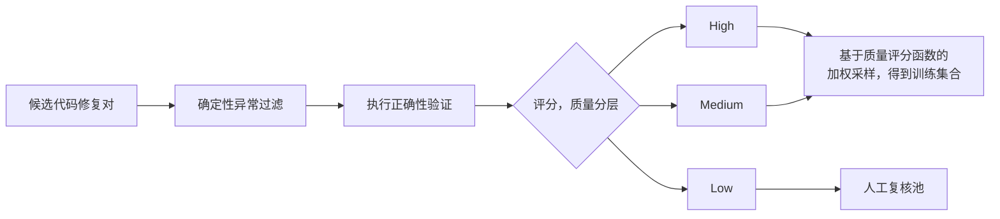

<div align="center">

# Verilog 代码智能修复模型

**💻 面向 BUAA CS 专业课的 Verilog 代码纠错模型**

**实现在保留学生原始结构的同时，完成必要正确的修复。🎉**


<!--  -->

</div>

## 项目概述

通用代码大模型在修复 Verilog 作业时，容易把“纠错”变成“重写”：虽然输出可能可编译，却破坏了学生原有结构，也不利于教学分析。本项目基于 **Qwen2.5-Coder-7B-Instruct** 进行 LoRA 监督微调，让模型从真实的 `FAIL → AC` 提交对中学习最小必要修改，并通过真实 testbench 编译、仿真和判题。

### 核心特性

- **结构保持修复**：输入题目描述与 buggy Verilog，输出完整修复代码，减少无关改写。
- **真实教学数据**：提供 train/dev/test 三个 SFT 切分，共 6,969 个代码对，按学生划分以降低数据泄漏风险。
- **参数高效训练**：基于 PEFT LoRA，仅训练注意力和 MLP 投影层的低秩适配参数。
- **可复现评测**：固定贪心解码、随机种子、测试集和判题资源，保留生成、编译及仿真日志。
- **完整数据流水线**：覆盖清洗、编辑距离过滤、testbench 验证、SFT 转换、训练与结果分析。

工作流：`学生提交 → FAIL→AC 配对与清洗 → Chat SFT → LoRA 训练 → 生成修复 → Icarus Verilog 判题`。


### 数据质量评分函数与分层采样策略

高质量代码修复数据不仅要求修改后的程序正确，还应尽可能保留修改目标明确、错误模式具有代表性且修复过程包含有效监督信息的样本。对于程序修复任务而言，较大的代码差异并不必然意味着低质量：它既可能来自无关重构，也可能对应组合错误、多点修复或复杂功能缺陷。因此，若直接按照编辑距离设置统一阈值，容易造成过度清洗，并丢失具有训练价值的困难修复样本。基于这一考虑，本项目将数据清洗设计为 **确定性异常筛除、多维质量评分与按分数采样** 三个阶段，整体流程如下图所示。



#### 1. 确定性异常过滤

首先仅筛除能够明确判断为异常的样本，包括已经确认文件乱码、题目超出课程范围、代码为空以及修改前后内容完全相同等情况。对于编辑距离较大、修改位置较多或修复形式较复杂的样本，不直接删除，而是交由后续评分过程判断其训练价值，从而尽可能保留真实存在的复杂错误模式。

#### 2. 基于数据质量评分函数进行评估

对于通过初步筛选的代码修复对，从执行正确性、修复纯度、题型覆盖和修复信息量四个维度进行综合评估：
$$
Q(x)=0.40C(x)+0.30P(x)+0.20D(x)+0.10I(x)
$$

- $C\ (\text{Correctness})$：**执行结果是标签可信度的底线，未经验证的代码对不应直接参与训练**。每个 `FAIL→AC` 样本需经过本地 testbench 执行验证；`FAIL` 要求原代码至少未通过一个 测试点，`AC` 要求修复代码通过全部测试点。验证通过记为 1.0，未验证记为 0。

- $P\ (\text{Purity})$：**优先保留聚焦于单一错误的最小修复，减少无关重构对模型的干扰。**
  首先计算归一化编辑距离$\displaystyle d=\frac{\operatorname{Lev}(buggy,fixed)}{\max(|buggy|,|fixed|)}$，再令 $P=1-d$。修改范围越小，$P$ 越接近 1。
- $D\ (\text{Diversity})$：**适当提高稀缺题型的采样机会，同时通过平方根缩放避免低频样本被过度放大。**
  按题目统计通过硬过滤后的样本频次，令$\displaystyle D=\sqrt{\frac{n_{\min}}{n_p}}$，其中 $n_p$ 为当前题目的样本数，$n_{\min}$ 为所有题目中的最小样本数。
- $I\ (\text{Informativeness})$：**降低几乎没有实质修改的简单样本价值，同时避免模型偏向整体重写**。令$\displaystyle I=\min\left(1,\frac{d}{0.05}\right)\times P$。当修改比例低于 5% 时，信息量随编辑距离增加；超过 5% 后由 $P$ 抑制大面积改写。

#### 3. 质量分层与采样

根据综合质量分数将样本划分为 `high`、`medium` 和 `low` 三个层级。`high` 和 `medium` 样本依据 (Q(x)) 进行加权无放回采样，高分样本获得更高的进入训练集概率；`low` 样本统一进入人工复核池，用于进一步检查标签错误、异常重构以及评分函数未覆盖的特殊修复情况。采样过程使用固定随机种子，以保证数据构建结果可复现。

#### 4. 数据清洗结果

在 19,234 个候选代码对中，共筛除 85 个能够明确确认的异常样本，其余 19,149 个进入质量评估阶段；其中 `high` 8,699 个、`medium` 10,318 个、`low` 132 个，并将全部 `low` 样本送入人工复核池。按照 80% 的数据预算，最终选取 15,319 个训练候选样本。上述统计仅使用数据划分前已经确定的课程题目目录，不读取测试集分布信息。该策略避免使用统一阈值大规模删除复杂修复样本，在代码正确性、修复集中程度、题型覆盖和修复多样性之间取得较为稳定的平衡。实现见 [`score_and_sample_repair_pairs.py`](https://chatgpt.com/c/download/filtering/score_and_sample_repair_pairs.py)。

## 实验结果

固定测试集包含 **737 个样本、47 道题**(题目与代码相关数据尚未上传)。每个样本只生成一个候选，且通过该题全部测试用例才记为修复成功。

| 模型 | 修复数 | Repair Rate@1 |
| --- | ---: | ---: |
| Qwen2.5-Coder-7B-Instruct | 209 / 737 | 28.36% |
| LoRA SFT | **494 / 737** | **67.03%** |

LoRA 相比基线提升 **38.45 个百分点**。

## 安装

### 环境要求

- Linux、Python 3.10+
- 支持 BF16 的 NVIDIA GPU 与 CUDA
- `iverilog`、`vvp`
- 本地 Qwen2.5-Coder-7B-Instruct 权重

```bash
sudo apt-get update
sudo apt-get install -y iverilog

python -m venv .venv
source .venv/bin/activate
pip install torch
pip install transformers peft accelerate wandb pyyaml
pip install flash-attn --no-build-isolation

huggingface-cli download Qwen/Qwen2.5-Coder-7B-Instruct \
  --local-dir models/Qwen2.5-Coder-7B-Instruct
```


## 快速开始

先在一分钟内完成环境与判题链路自检：

```bash
python -m unittest discover -s tests -v
```

运行 3 个样本的基线冒烟评测：

```bash
python scripts/run_qwen_baseline_archive_split.py \
  --limit 3 \
  --output runs/baseline_smoke
```

评测支持生成与判题分阶段执行；显存不足时会自动降低生成 batch size。

## 训练与评测

### 1. 审计训练数据（可选）

```bash
python scripts/prepare_testbenches.py --all-splits \
  --output testbench/audit_prepared
```

### 2. 训练 LoRA

```bash
wandb login
python scripts/train_qwen_lora_sft.py \
  --output runs/qwen25_coder_7b_lora_sft
```

默认配置为 2 epochs、最大序列长度 8192、BF16、FlashAttention 2、gradient checkpointing；LoRA 使用 `r=16`、`alpha=32`、`dropout=0.05`，只对 assistant 回复计算 loss。训练完成后自动在 test 集计算 Repair Rate@1，可用 `--skip-test` 跳过。

### 3. 独立评测与续跑

```bash
# 使用已有 adapter 重新生成并判题
python scripts/train_qwen_lora_sft.py --eval-only \
  --output runs/qwen25_coder_7b_lora_sft

# 基线中断后续跑
python scripts/run_qwen_baseline_archive_split.py --resume \
  --output runs/qwen25_coder_7b_baseline_archive
```

主要产物包括 `results.jsonl`、`summary.json`、`testcase_manifest.json`、逐样本 `repair.v` 以及编译/仿真日志。详细脚本索引见 [`scripts/README.md`](scripts/README.md)，原始数据处理流程见 [`download/README.md`](download/README.md)。

## 数据格式

每条 JSONL 包含 `pair_id`、`problem_id` 和三轮 `messages`：system 定义任务，user 提供题目与 buggy 代码，assistant 提供 fixed 代码。Train/Dev/Test 分别有 5,413/819/737 条，覆盖 58/51/47 道题。

## Roadmap

- [ ] 增加更多课程题目与边界测试用例
- [ ] 提供统一依赖文件和一键训练配置
- [ ] 增加最小编辑距离、语法正确率等辅助指标
- [ ] 对比更多代码模型与参数高效微调方法

## 贡献

欢迎提交 Issue 或 Pull Request。贡献前请运行完整测试，并确保新增 Python 脚本包含功能说明、核心逻辑说明和适量中文注释。涉及数据或指标的改动，请同时提供数据来源、划分方式和可复现实验命令。

## License

本仓库当前未附带开源许可证。在许可证明确前，代码默认保留所有权利，不应视为已获得复制、修改或分发授权。
